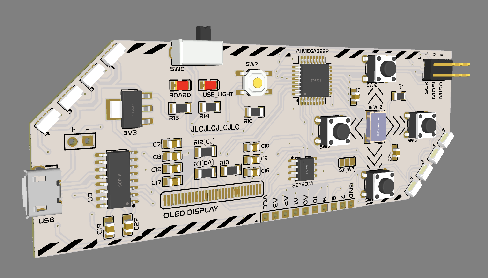

# PCB V2
This is version two of the PCB, it will function using the ATmega328p with a USB to Serial converter so you can program it via the Arduino IDE

### issues
Trouble connecting to ATmega328p to load bootloader. I tried recreating the circuit on a breadboard and it worked there. There will be another version designed for testing the circuit on the board with test pads and labeling.

### Notes 
*Make sure to have the drivers for the CH340C USB to Serial converter installed for it to work properly.* Write/Protect solder jumper is connect to GND by default and allows normal write functions to the EEPROM module, when the right track is cut and the left pad is connected to the center pad via a solder bridge it will connect to VCC and block write functions to the EEPROM module. *Be Careful to ensure the right most and left most pads on the solder junction are not connected as to prevent a short circuit.* Integrated OLED module on the board is untested. Pin assignments for Arduino programming are as follows:
```
int Up_Button = 3;
int Down_Button = 4;
int Left_Button = 5;
int Right_Button = 6;
int LED_Data_Pin = 2;
//OLED(Address: 0x3C) and EEPROM(Waiting for board to arrive to confirm Address) are on the I2C bus on Pins A5(SCL) and A4(SDA)
```



Components descriptions are as follows:
```
C7 - 10uF capacitor
C8 - 10uF capacitor
C9 - 0.1uF capacitor
C10 - 10uF capacitor
C16 - 1uF capacitor
C17 - 1uF capacitor
C18 - 1uF capacitor
C19 - 100nF capacitor
C20 - 22pF capacitor
C21 - 22pF capacitor
C22 - 10nF capacitor

R10 - 1kΩ resistor
R11 - 1kΩ resistor
R12 - 1kΩ resistor
R13 - 330Ω resistor
R14 - 10kΩ resistor
R15 - 10kΩ resistor
R16 - 10kΩ resistor
```