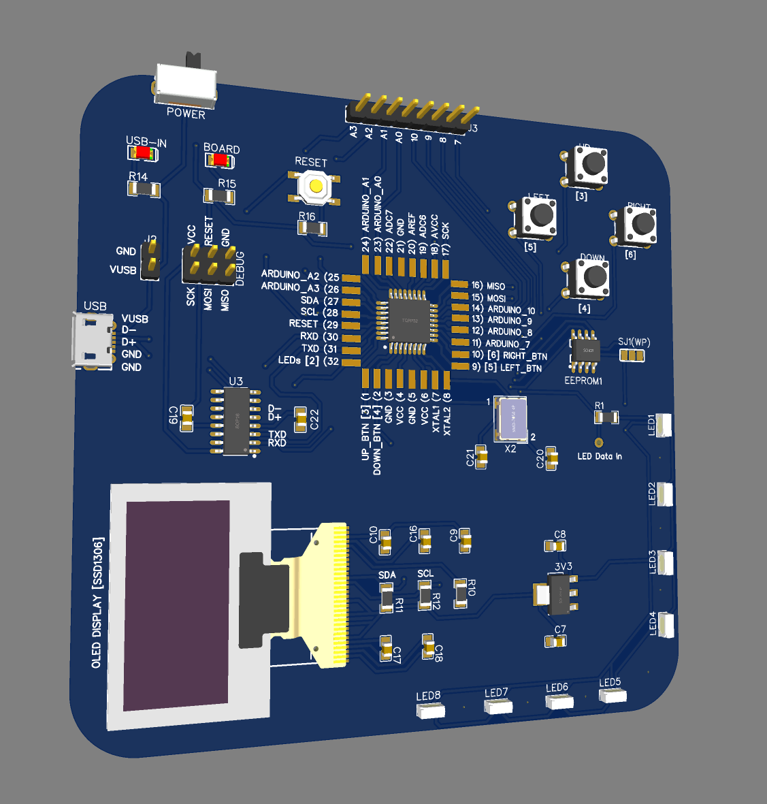
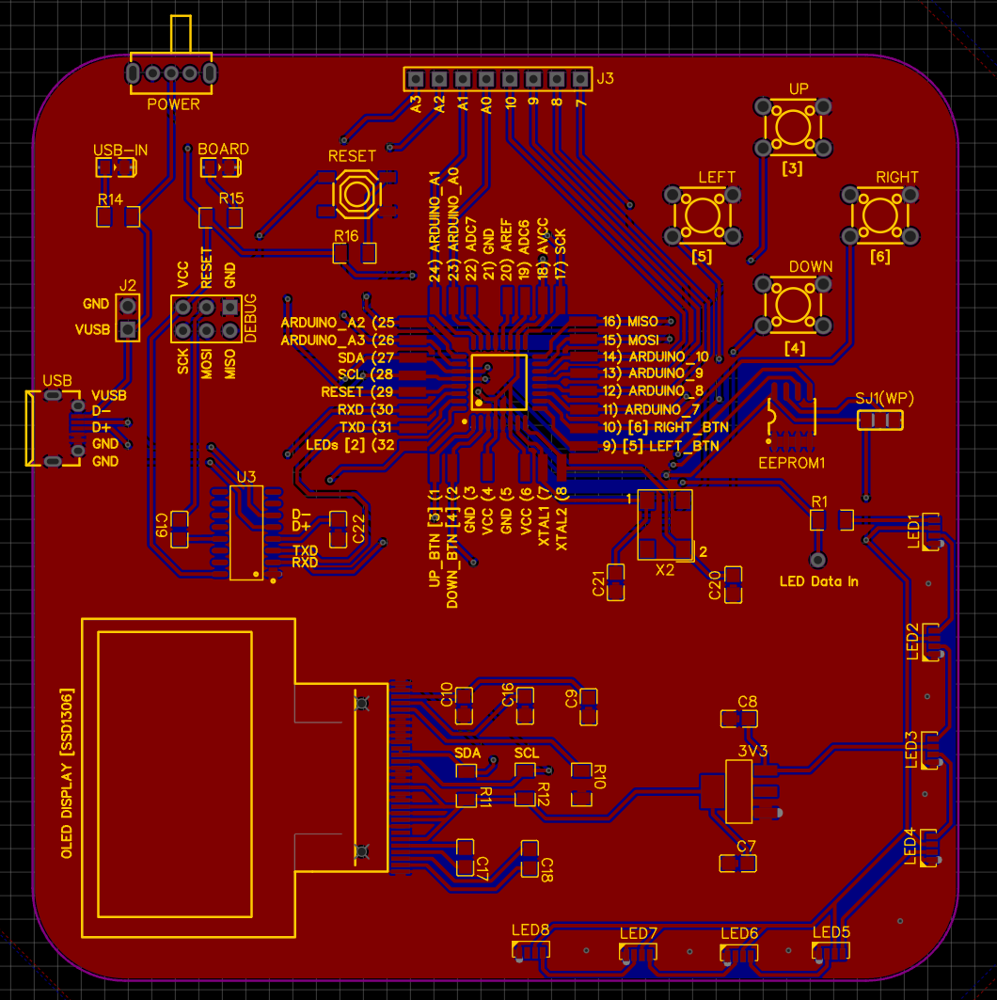

# PCB V3

Version three is to try and debug the circuit used for V2. 

**Update!** I found an issue with the was I wired the 16MHz Crystal Oscilator I was using. I left the unused connections floating but I think I was suppost to ground them. I'm using a different one for now but I plan to make the original one work.

### issues

OLED Display is not working. Having trouble getting the CH340C to properly communicate with the MCU.

### Notes

- Sucsefully uploaded bootloater to MCU

- LEDs Working with MCU ✓

- Testing Button Reading soon

This PCB is designed for testing the circuit. There are lots of pads you can solder onto. *This one is mainly for me so I can see why the circuit for the last PCB didn't work.* I remade the circuit on a breadboard and it works so I'm real confused. I'll still include the same information as the last version that way it's known which component goes where and pin assignments for Arduino. The BOM is also the same as V2.

```
int Up_Button = 3;
int Down_Button = 4;
int Left_Button = 5;
int Right_Button = 6;
int LED_Data_Pin = 2;
//OLED(Address: 0x3C) and EEPROM(Waiting for board to arrive to confirm Address) are on the I2C bus on Pins A5(SCL) and A4(SDA)
```




Component descriptions are as follows:

```arduino
C7 - 10uF capacitor
C8 - 10uF capacitor
C9 - 0.1uF capacitor
C10 - 10uF capacitor
C16 - 1uF capacitor
C17 - 1uF capacitor
C18 - 1uF capacitor
C19 - 100nF capacitor
C20 - 22pF capacitor
C21 - 22pF capacitor
C22 - 10nF capacitor

R10 - 1kΩ resistor
R11 - 1kΩ resistor
R12 - 1kΩ resistor
R13 - 330Ω resistor
R14 - 10kΩ resistor
R15 - 10kΩ resistor
R16 - 10kΩ resistor
```